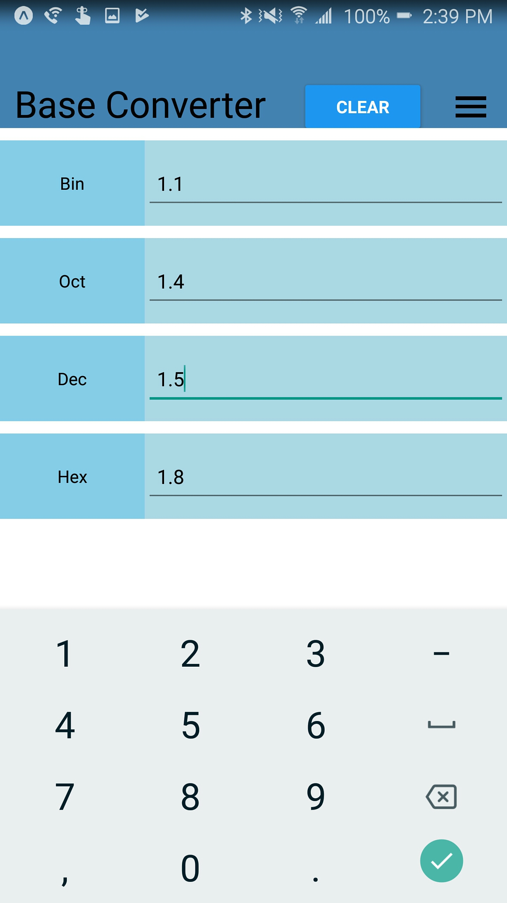
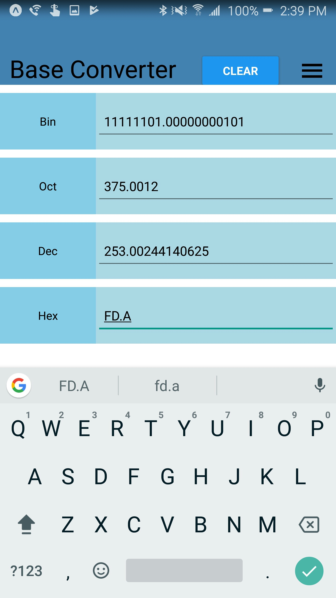

# base_converter
React native app that allows user to convert numbers of one base to another base. 

Automatically converts to the other types: binary, octal, decimal, hexidecimal as you type the number.

Supports floating point numbers for all four bases.

## Demo Pictures

